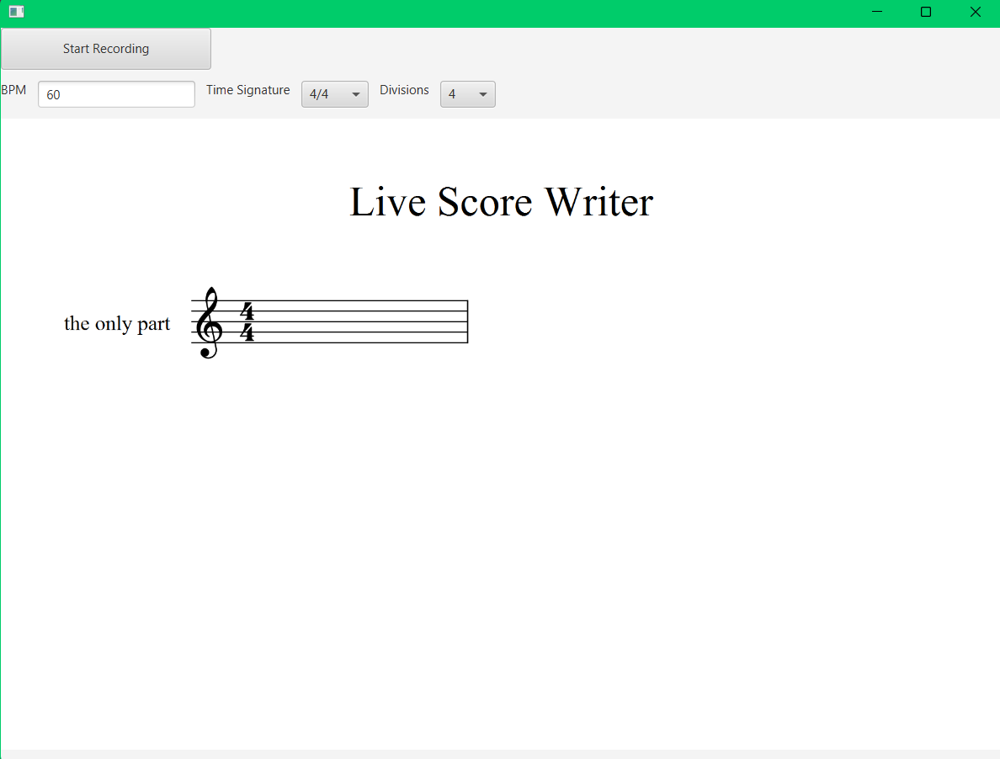

### Live Score Writer

A Java application that converts live microphone audio into written sheet music as the user plays along with a metronome. This is done by detecting pitch, determining note durations, generating MusicXML, and rendering the resulting score in real time.

### Description

Live Score Writer captures audio from a microphone and processes it in real time to transcribe musical audio into sheet music. The application uses the YIN pitch-detection algorithm to estimate the frequency of each audio sample window and maps the detected frequencies to their corresponding musical notes. A configurable metronome establishes the musical timeline used to organize detected notes and durations into measures. The resulting musical structure is converted into MusicXML using ProxyMusic and JAXB, then passed to OpenSheetMusicDisplay through a JavaFX WebView to display the generated sheet music.

### Usage

Once you run the code, you will see this application below.

At the top of the application, you can configure the BPM, time signature, and subdivision. The subdivision is determined by the selected divisions value, which represents the number of subdivisions per quarter note. For example, the default divisions value of 4 means that each quarter note is divided into four subdivisions, resulting in 16th-note subdivisions.

The subdivision is always calculated relative to the quarter note, regardless of the selected time signature. For example, with a 6/8 time signature and a divisions value of 4, the subdivision remains 16th notes because there are four divisions per quarter note.

Once you hit the Start button, the metronome begins, processing what you play and aligning it with the metronome beats.

For the most consistent results, it's suggested to avoid smaller subdivisions, and stick to 8th notes as the smallest subdivision.

#### Running the Program

1. Clone the repository:

    ```bash
    git clone https://github.com/EthanYLeong/Live-Score-Writer
    ```

2. Open the project in a Java-compatible IDE such as IntelliJ IDEA or VS Code.

3. Ensure that a supported JDK and JavaFX installation are configured.

4. Connect a microphone to the computer.

5. Open a terminal in the project directory.

6. Build the project:

    ```bash
    ./gradlew build
    ```

    On Windows:

    ```powershell
    .\gradlew.bat build
    ```

7. Run the application:

    ```bash
    ./gradlew run
    ```

    On Windows:

    ```powershell
    .\gradlew.bat run
    ```

8. Follow the steps under [Usage](#usage).

## Tech Stack

- **Java** — Core application and audio processing
- **Java Sound API** — Microphone audio capture
- **YIN** — Fundamental frequency detection
- **ProxyMusic** — MusicXML object model
- **JAXB** — MusicXML marshalling
- **JavaFX** — Application interface and WebView
- **OpenSheetMusicDisplay** — MusicXML sheet music rendering
- **Gradle** — Build automation and dependency management